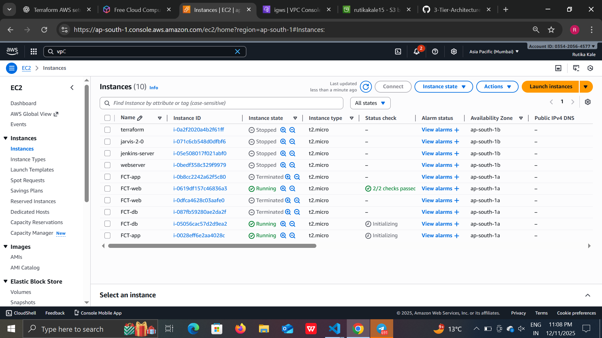
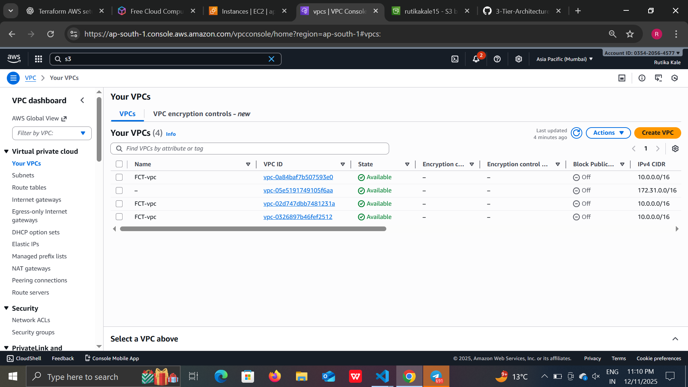
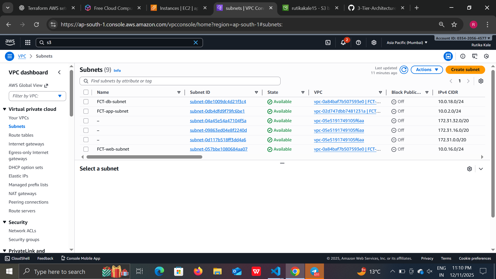

# 🚀 3-Tier Architecture on AWS Using Terraform

This project deploys a complete **3-Tier Architecture** on AWS using **Terraform**.  
The setup includes a **Web Tier (Public Subnet)**, **App Tier (Private Subnet)**, and **Database Tier (Private Subnet)** with secure routing, NAT Gateway, and Internet access for required layers.

---

## 🏗️ Architecture Overview


### **VPC Setup**
- Custom VPC (`10.0.0.0/16`)
- Three subnets:
  - Public Subnet (Web Tier)
  - Private Subnet (App Tier)
  - Private Subnet (DB Tier)
- High Availability using different AZs

### **Networking Components**
- Internet Gateway (IGW)
- NAT Gateway for private instances
- Public Route Table → IGW
- Private Route Table → NAT Gateway

### **Compute**
- EC2 Web Server (public)
- EC2 App Server (private)
- EC2 DB Server (private)

### **Security**
- Security Group allowing:
  - SSH (22)
  - HTTP (80)
  - HTTPS (443)

---

## 📁 Project Structure
```
├── main.tf
├── variables.tf
├── outputs.tf
├── README.md
└── img/ (All screenshots & diagrams)
```


---

## ⚙️ Requirements

| Tool | Version |
|------|---------|
| Terraform | v1.5+ |
| AWS CLI | v2 |
| AWS Account | Required |
| SSH Key | Must exist in AWS EC2 panel |

---

## 🔧 How to Use

### **1. Configure AWS Credentials**
```
aws configure
```
Enter:

* AWS Access Key

* AWS Secret Key

* Region

* Output format

### **2. Initialize Terraform**
```
terraform init
```
### **3. Validate Configuration**
```
terraform validate
```
### **4. Deploy Infrastructure**
```
terraform apply --auto-approve
```
## 🌐 Outputs

After deployment, Terraform prints:

* Web Server Public IP

* App Server Private IP

* DB Server Private IP

Example:
```
web_public_ip = "13.xxx.xxx.xxx"
app_private_ip = "10.0.2.10"
db_private_ip  = "10.0.3.12"
```
## 🧹 Destroy Infrastructure
```
terraform destroy --auto-approve
```
## 📸 Screenshots

#### **1️⃣ Terraform Apply Output**


---

#### **2️⃣ S3 Bucket (Terraform Backend)**


---

#### **3️⃣ EC2 Instances**



---

#### **4️⃣ VPC Overview**



---

#### **5️⃣ Subnets (Public, App, DB)**



---

#### **6️⃣ Route Tables**


---

#### **7️⃣ Internet Gateway (IGW)**


---

#### **8️⃣ NAT Gateway**


---

## 📌 Features

✔ Fully automated 3-tier infrastructure

✔ Modular, scalable architecture

✔ Secure private networking

✔ NAT-enabled outbound access

✔ Reusable Terraform variables

✔ AWS best-practice design

## 🧑‍💻 Author

Rutika Kale

Terraform | AWS | DevOps | Cloud Projects